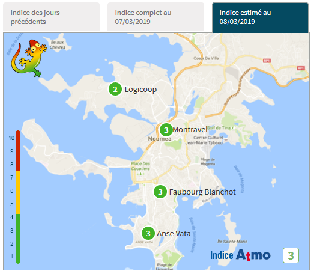

[](https://travis-ci.org/adriens/scalair4J)
[](https://jitpack.io/#adriens/scalair4J)

# scalair4J

SDK Java pour Scal-Air pour interagir simplement avec ces données.

***Pour l'instant seules les données live sont disponibles, 
c'était la priorité.***

# Récupération des données estimés live du jour :

Pour récupérer les données que l'on retrouve en pemier sur la
[page de ScalAir](http://www.scalair.nc/)



# Usage

```java
StationCrawler crawler = new StationCrawler();
Station aStation = crawler.getStationsStatuses().get(Station.NOM_STATION_ANSE_VATA);
System.out.println("#########################################");
System.out.println(aStation);
System.out.println("#########################################");
```

Donne ceci :

```
#########################################
Nom : <Anse Vata>
Coleur : <GREEN>
IGA : <3>
Message : <Bon>
Typologie : <URBAINE>
#########################################
```
